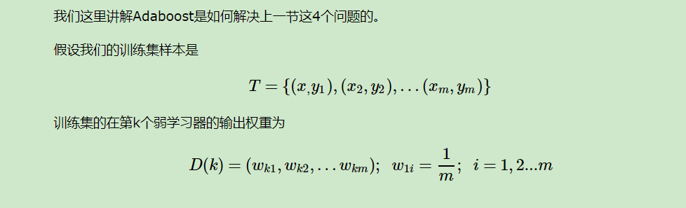
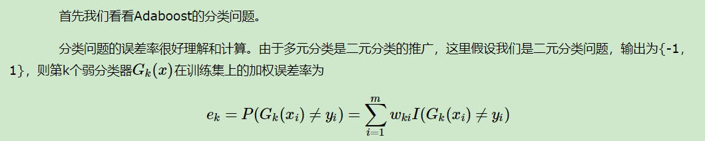
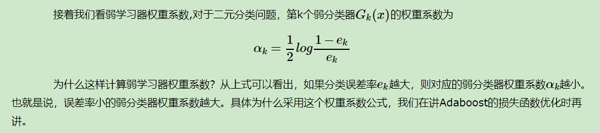
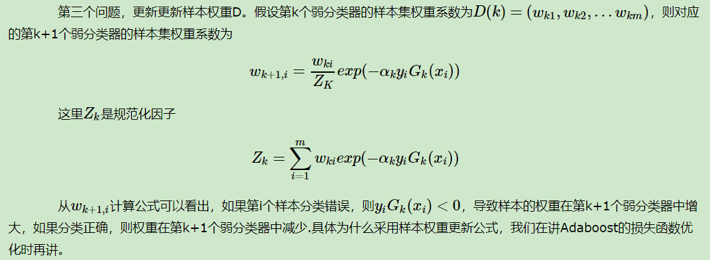
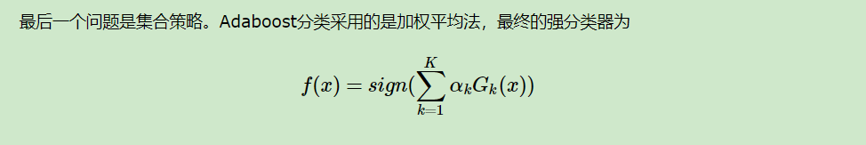
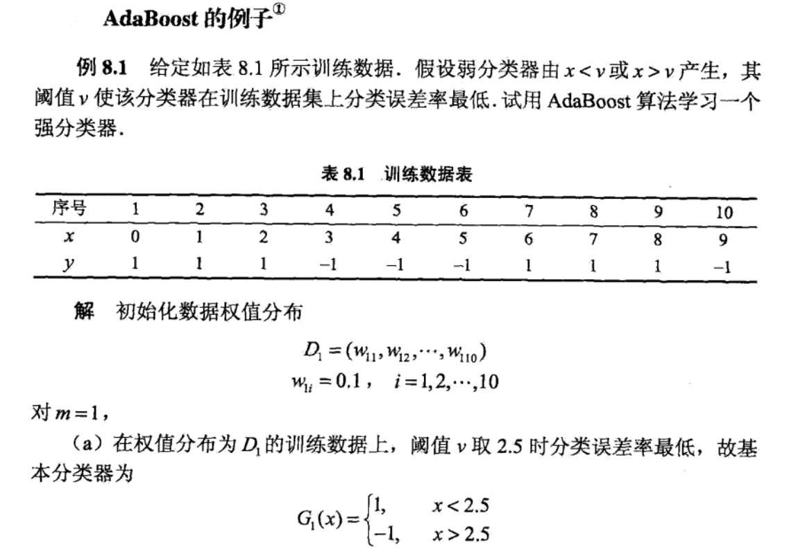
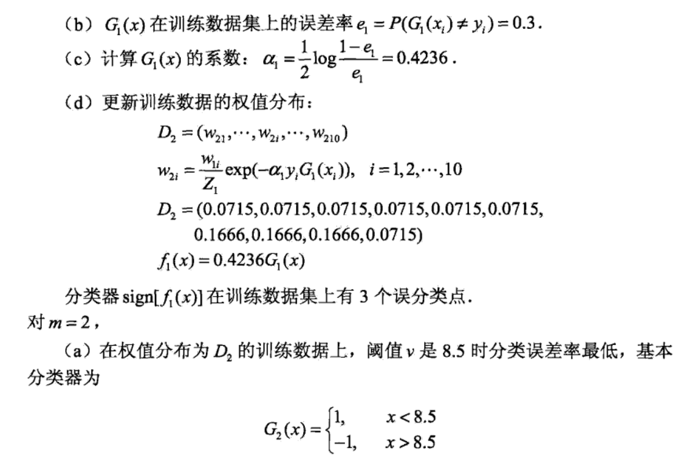
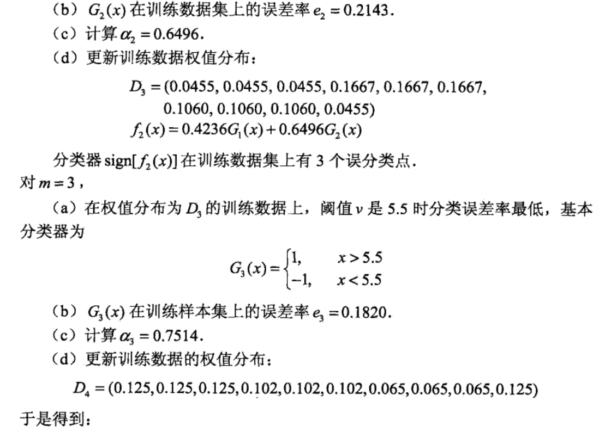
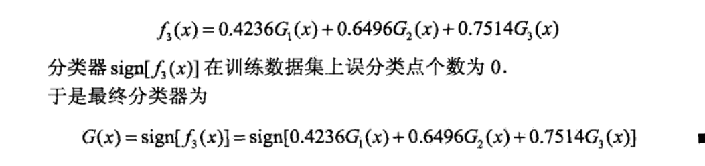

# Adaboost

在boosting系列算法中， Adaboost是最著名的算法之一。Adaboost既可以用作分类，也可以用作回归。本文就对Adaboost算法做一个总结。

## Boosting算法的基本原理

​	在看Adaboost之前，先看Boosting的基本原理。

从图中可以看出，Boosting算法的工作机制是首先从训练集用初始权重训练出一个弱学习器1，根据弱学习的学习误差率表现来更新训练样本的权重，使得之前弱学习器1学习误差率高的训练样本点的权重变高，使得这些误差率高的点在后面的弱学习器2中得到更多的重视。然后基于调整权重后的训练集来训练弱学习器2.，如此重复进行，直到弱学习器数达到事先指定的数目T，最终将这T个弱学习器通过集合策略进行整合，得到最终的强学习器。　　

不过有几个具体的问题Boosting算法没有详细说明。

1. 如何计算学习误差率e?
2. 如何得到弱学习器权重系数α?
3. 如何更新样本权重D?
4. 使用何种结合策略？

只要是boosting大家族的算法，都要解决这4个问题。那么Adaboost是怎么解决的呢？

## Adaboost

### 1.基本理论

1. 如何计算学习误差率e?

2. 如何得到弱学习器权重系数α?

3. 如何更新样本权重D?

4. 使用何种结合策略？

### 2.一个例子

## 参考：

刘建平：[集成学习之Adaboost算法原理小结](http://www.cnblogs.com/pinard/p/6133937.html)

李航：《统计机器学习》