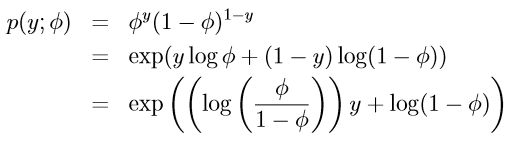

# 线性模型

参考：https://zhuanlan.zhihu.com/p/22876460

1. 知乎文章：

## 广义线性模型

### 1. 概要

本文将会说明线性回归和逻辑回归都是广义线性模型的一种特殊形式，介绍广义线性模型的一般求解步骤。 利用广义线性模型推导出多分类的Softmax Regression（回归实际上是分类）。

线性回归中我们假设：

逻辑回归中我们假设：

其实它们都只是 广义线性模型 (GLMs) 的特例。提前透露：有了广义线性模型下我们只需要把符合指数分布的一般模型的参数转换成它对应的广义线性模型参数，然后按照 广义线性模型的求解步骤即可轻松求解问题。

### 2. 指数分布族（ The exponential family）

首先我们定义一下什么是指数分布族，它有如下形式：

简单介绍下其中的参数 （看不懂没关系）

- ${\eta}$ 是自然参数 （ natural parameter ）
-  是充分统计量（ sufficient statistic ） （一般情况下 $T(y) = y$）
- $a(\eta)$ 是 log partition function （ $e^{ - a(\eta)}$充当正规化常量的角色，保证 $\sum p(y; \eta)  = 1$

也就是所 T，a，b 确定了一种分布，$\eta$是该分布的参数。

选择合适的 T， a，b 我们可以得到高斯分布和 Bernoulli 分布。

**Bernoulli分布的指数分布族形式：**

=>

即：在如下参数下广义线性模型是Bernoulli 分布

Gaussian 分布的指数分布族形式：

在线性回归中，$\sigma$对于模型参数 $\theta$ 的选择没有影响，为了推导方便我们将其设为1：

得到对应的参数：

### 3. 用广义线性模型进行建模

想用广义线性模型对一般问题进行建模首先需要明确几个假设：

1. $y | x;θ \sim ExponentialFamily(\eta)$ 即在给定$x$和$\theta$的y的情况下，y服从指数分布族。
2. 给定x 广义线性模型的目标是求解 $T(y) | x$ 的期望， 不过由于很多情况下 $T(y) = y$ 所以我们的目标变成了  , 也即我们希望拟合函数为 $h(x) = E[y|x]$ ( 备注： 这个条件在 线性回归和逻辑回归中都满足， 例如逻辑回归中 $h_θ(x) = p(y = 1|x;\theta) = 0 \cdot p(y = 0|x; \theta) + 1 \cdot  p(y = 1|x; \theta) = E[y|x;\theta])$ 。
3. 自然参数 $\eta$与 x是线性关系 ： $\eta = \theta ^T x $( $\eta$为向量时 $\eta_{i} = \theta_{i} ^T x $)。

这些假设中的第三个似乎对上述假设最没有道理，并且在我们设计GLM的配方中，它可能被更好地视为“设计选择”，而不是作为假设本身。这三个假设/设计选择将允许我们导出一类非常优雅的学习算法，即GLM，它们具有许多期望的特性，例如易于学习。此外，所得到的模型通常对于模拟y上的不同类型的分布非常有效；例如，我们很快将表明逻辑回归和普通最小二乘都可以导出为GLM。

具体参考下面例子。

**广义线性模型 推导出 线性回归：**

step1: $y | x;θ \sim N( \mu , \theta)$

step2: 由假设2 $ h(x) = E[y|x]$ 得到：

广义线性模型 推导出 逻辑回归

：

step1: $y|x;\theta \sim Bernoulli(\phi)$

step2: 与上面同理

**广义线性模型推导出 Softmax Regression （多分类算法 **）：

【step1】:

y有多个可能的分类： $y \in   \left\{   1,2,...,k  \right\}$，

每种分类对应的概率： $\phi_{1}, \phi_{2}, \cdots ,\phi_{k}$ 但是 由于$\sum _{i =1}^{k}{\phi_{i}} = 1$ , 所以一般 用 k-1个参数$\phi_{1}, \phi_{2}, \cdots ,\phi_{k-1}, $ 其中$\phi_{i} = p(y = i; \phi) \; , p(y = k; \phi) = 1 - \sum _{i=1}^{ k-1} {\phi_{i}}$

为了将多项分布表达为指数族分布：

- 定义 $T(y) \in  R^{k-1}$，它不再是一个数而是一个向量：

- 引进指示函数： $1 \left\{ \cdot \right\} $为 $1\left\{ True \right\}  = 1 \; , 1\left\{ False \right\}  = 0$

得到它的指数分布族形式以及各个对应参数为：

求出 $\phi_{i}$ :

=>

也即：

至此我们就可以利用广义线性模型进行求解：

【step2】

可见拟合函数的输出结果是每一种分类对应的概率所组成的向量。

接下来只需要根据最大似然法拟合参数即可:

可以用梯度上升或着牛顿法。

