# SVM

## 一、线性支持向量机

###　1.直觉

​	先看一个问题。如图，有两类数据，正类用圈表示，负类用叉表示，而且这两类数据线性可分。线性可分的意思就是一条直线可以完全将两类数据完全分开，不存在分不开的情况。现在要将正类和负类完全分开，哪一条直线是最好的直线？

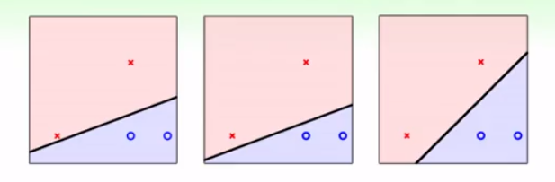

​	很显然，第三种是最好的方式，因为这个时候，直线离最接近自己的点的距离（也就是margin）最大。因为这样的直线可以容忍更多的noise，不容易过拟合，是更加robust的直线。

### 2.数学化

​	那么，这个问题怎么用数学方式来表示呢？

​	提取上述描述的信息中最关键的部分：1.直线需要将正类和父类完全分开。2.直线离最接近自己的点的距离(margin)最大。也就是说，需要在满足1的条件下，去考虑2。

​	对于条件1，假设直线的方程为$w^Tx+b=0$，那么，由于直线需要将正类和父类完全分开，,对于任意的$(x_n,y_n)，必须满足$$y_n(w^Tx_n+b)>0$。因为对于正类$w^Tx_n+b>0,y_n>0$，那么$y_n(w^Tx_n+b)>0$，对于负类，$w^Tx_n+b<0,y_n<0$，那么，$y_n(w^Tx_n+b)>0$。

​	然后，怎么定义margin呢？假设现在我们已经有了满足1的直线，也算出了所有点到这条直线的距离，那么margin实际上就是这些所有距离中最小的那个，可以用数学式子表示为$min_{1,...,n}\frac{|wx_n+b|}{||w||}$，又因为$y_n(w^Tx_n+b)>0$就相当于给$w^Tx_n+b$加了绝对值，因此，又可以化为：$min_{1,...,n}\frac{y_n(wx_n+b)}{||w||}$

综合以上，数学表达式为：
$$
max_{w^T,b}(min_{1,...,n}\frac{y_n(w^Tx_n+b)}{||w^T||})
$$

$$
s.t.\ y_n(w^Tx_n+b)>0, for\ all\ n
$$

### 3.转换目标函数

​	其实，以上已经将线性svm的目标函数给写出来了。但是这样的优化式是不容易直接求解的，我们可以将它进行一些转换，换成更容易解的形式。

​	我们知道，对于直线$w^Tx_n+b=0$，如果我们将$W^T,b$同时进行放缩，那么这条直线是不变的。既然如此，就直接将$y_n(w^Tx_n+b)$固定为1就好了啊，反正没差。这样，目标优化就变成了：
$$
max_{w^T,b}(\frac{1}{||w^T||})
$$

$$
s.t.\ min_{1,...,n}y_n(w^Tx_n+b)=1
$$

证明如下：

这个时候，目标式依然存在min操作，也是对解不利的。所以，考虑能不能直接把服从条件转换成如下形式呢？也就是放松了限制条件，不是让最小值为1，而是让所有都大等于1。也就说，有可能最小值不是1。
$$
s.t.\ y_n(w^Tx_n+b)>=1\ for\ all\ n
$$
但是，放松了条件会不会使解不一样了？假设$w^Tx_n+b>1.236\ for\ all\ n$。。。

因此，此时的目标优化式就变为了：
$$
max_{w^T,b}(\frac{1}{||w^T||})
$$

$$
s.t.\ y_n(w^Tx_n+b)>=1\ for\ all\ n
$$

然后再将最大化问题转化为最小化问题、乘以系数1/2，则最终的目标优化式就变为
$$
max_{w^T,b}(\frac{1}{2}w^Tw)
$$

$$
s.t.\ y_n(w^Tx_n+b)>=1\ for\ all\ n
$$

到了这个时候，目标优化式就变成了一个二次规划问题，将这个问题转为标准的二次规划的数学形式，丢给程序去解，就万事大吉了。

如果是非线性可分的，则可以找一个非线性转换，得到以下的目标优化，同样喂给二次规划工具就能得到解。

## 二、对偶支持向量机

​	但是，当数据的维度比较大的时候，要解二次规划的问题就会很困难，特别地，当维度无限大的时候，二次规划就歇菜了。所以，现在要寻求一种可以摆脱维度d依赖的算法。

​	因此，就要寻求原始问题的另外一种形式（也就是对偶问题），它只跟样本数量有关，而跟维度没有关系。

> mensaochun：将原始问题转为对偶问题主要有几个原因：
>
> 1. 原始问题是二次规划问题，可以用二次规划的程序很容易的解出来，但是当数据的维度很大的时候，二次规划解决起来就很慢。因此要寻求更好的办法。
> 2. 转为对偶问题之后，优化问题变得更简单，而且更重要的是可以很容易地引入核函数。

### 1.拉格朗日与对偶问题

首先，要介绍拉格朗日函数与对偶问题。

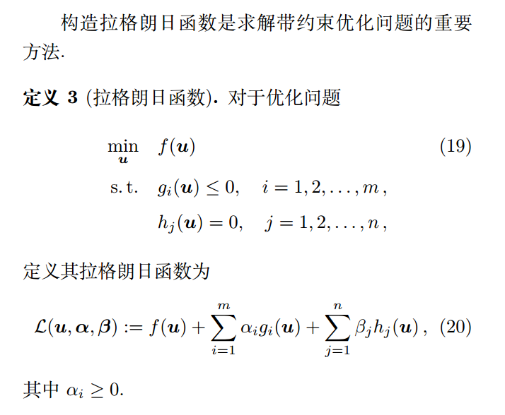

> mensaochun注：注意$α_i>=0$是针对于不等式来说的，等式不需要满足这样的条件。

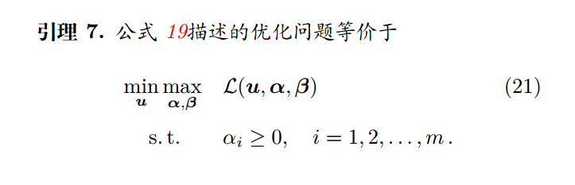

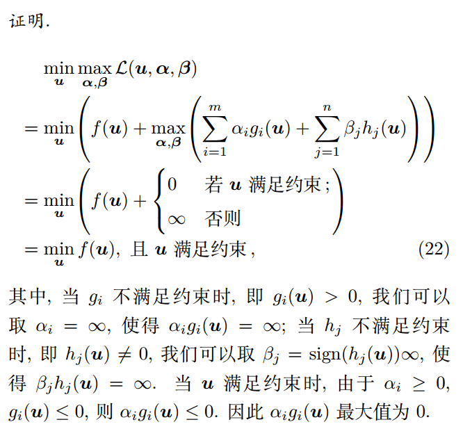

> mensaochun注：22中，最后一行是等号，是没有问题的。因为无穷大的最小化不可能比0的最小化更小。

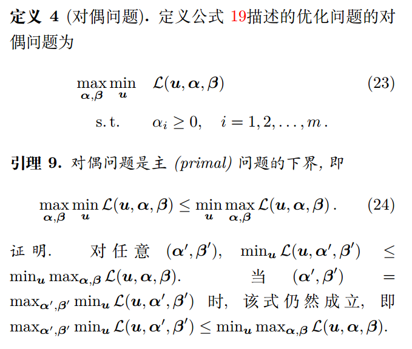

这个时候，>=是一种弱对偶，如果是=的话就是强对偶了。如果能满足强对偶的条件，那么原始问题和对偶问题的解就是一样的了。

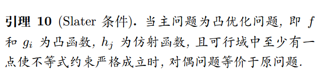

> mensaochun注：什么是仿射函数？svm中能保证g是凸函数，h是仿射函数吗？

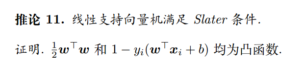

### 2.线性支持向量机对偶型 

#### 线性支持向量机的拉格朗日函数

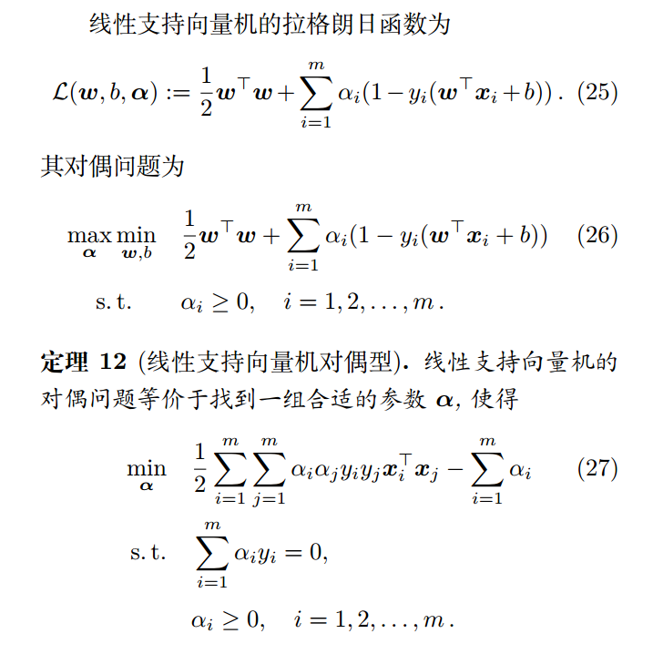

具体的推导过程见李航的书：

对于这个问题，只要解得$\alpha$(可以通过二次规划求解)就能带进去计算$w$，进而计算$b$ 。

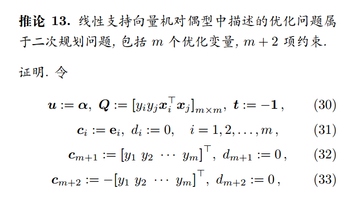

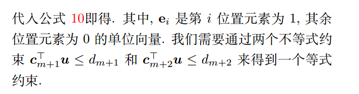

现在，得到了27，但是还要注意这个式子需要满足一定的条件，就是kkt条件。

解得alpha之后，带入kkt条件就可以得到w,b。

问题：松弛互补问题怎么来的？答：在推出对偶问题的时候导出来的。

总结一下便是：

#### 支持向量

## 三、核支持向量机

先做转换，再做内积，非常耗费时间。转换和内积一起做了就好了！

w和b都可以用kernel来进行表示，这个不用担心。

## 四、软间隔支持向量机

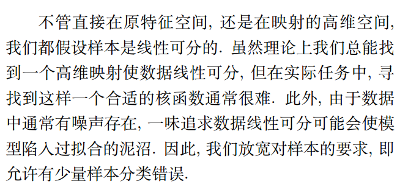

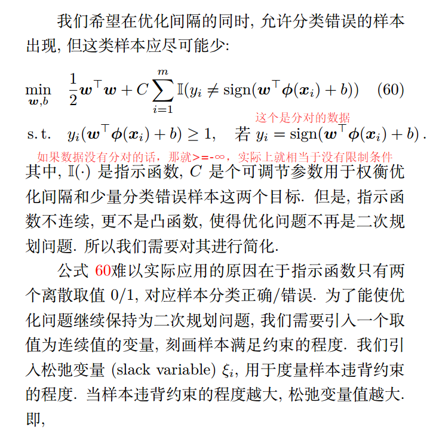

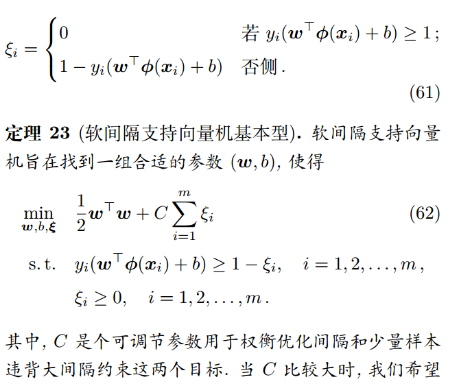

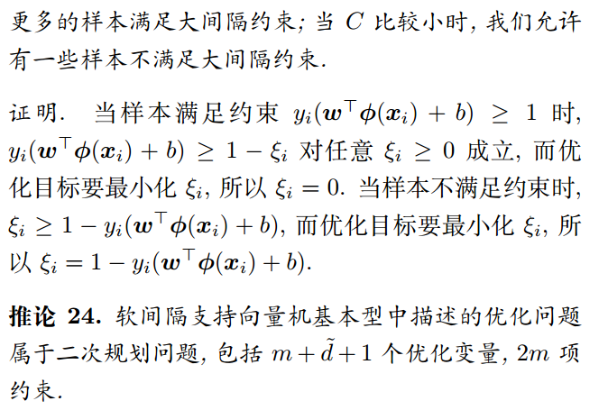

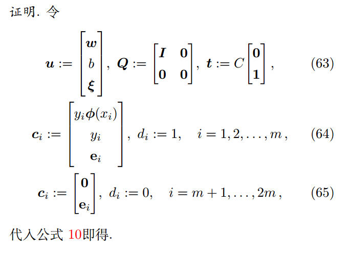

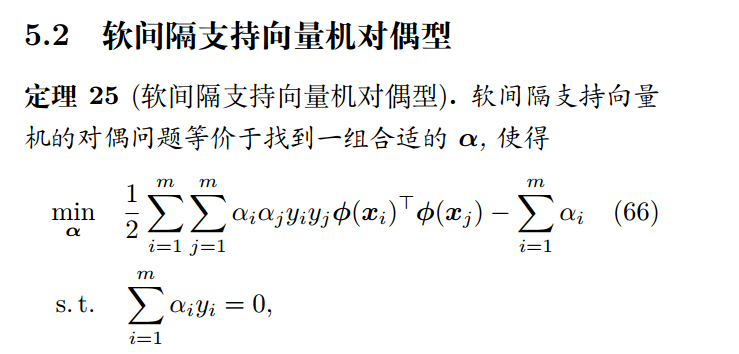

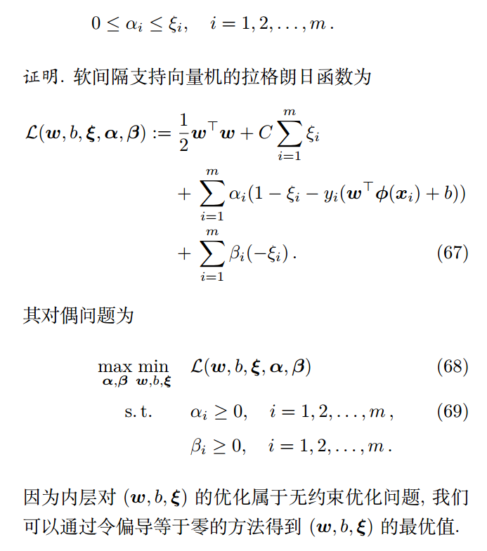

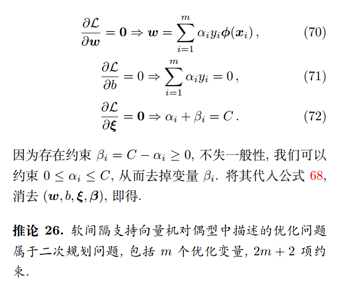

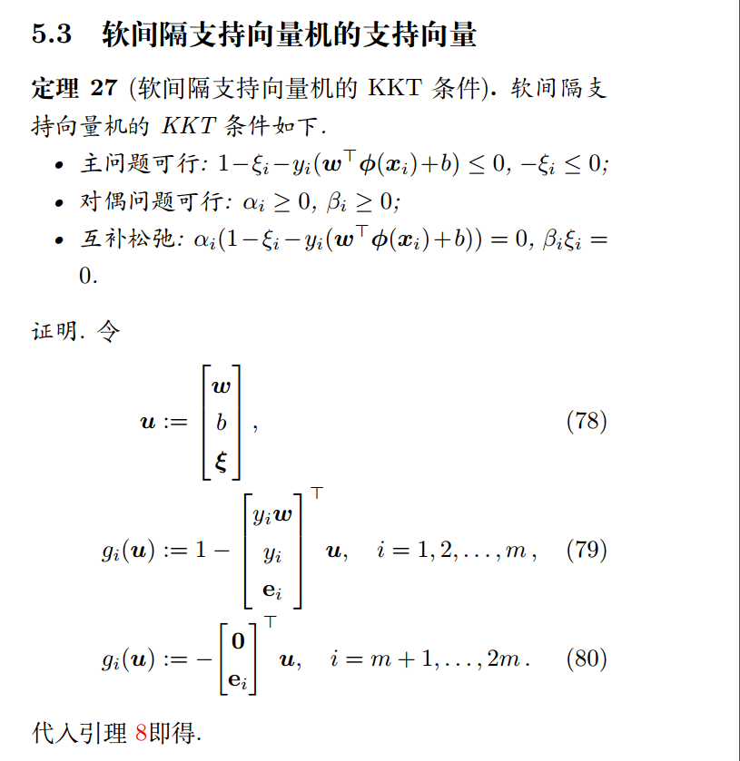

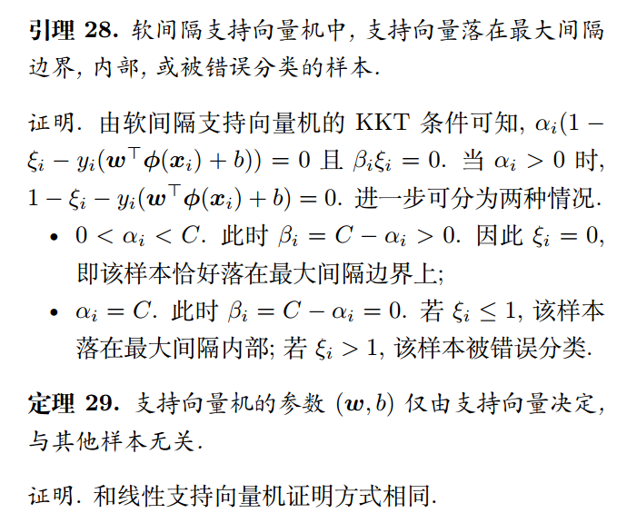