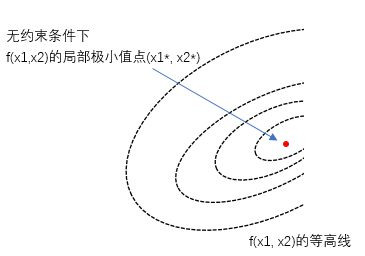
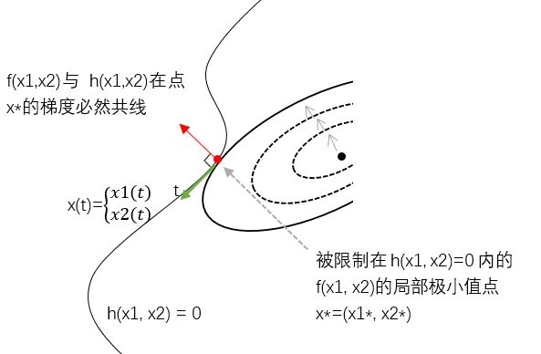
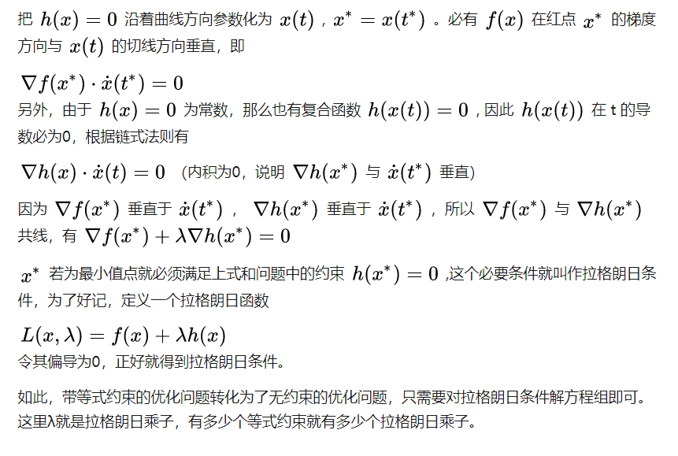
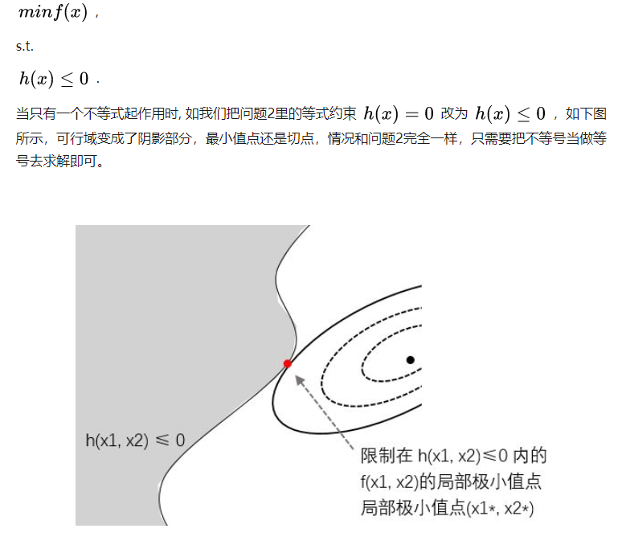
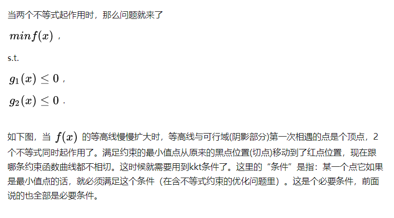
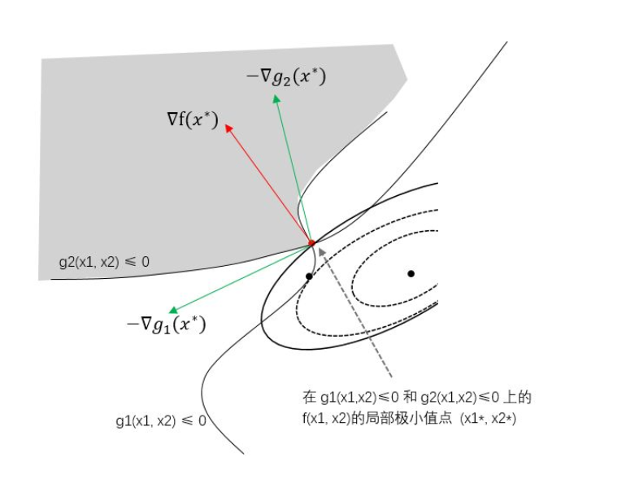
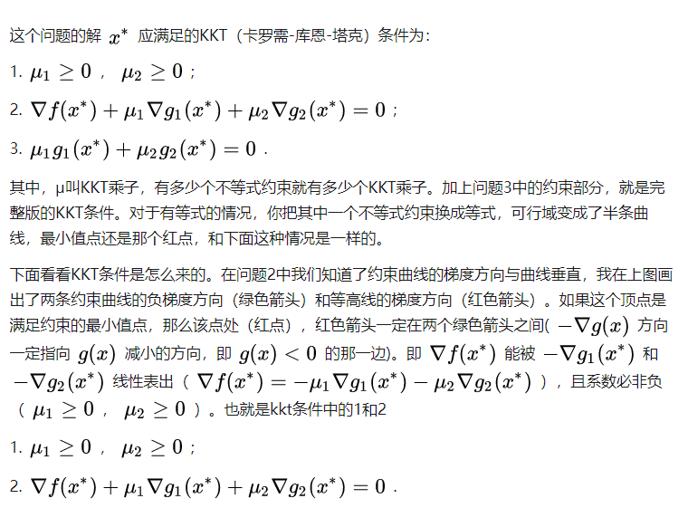
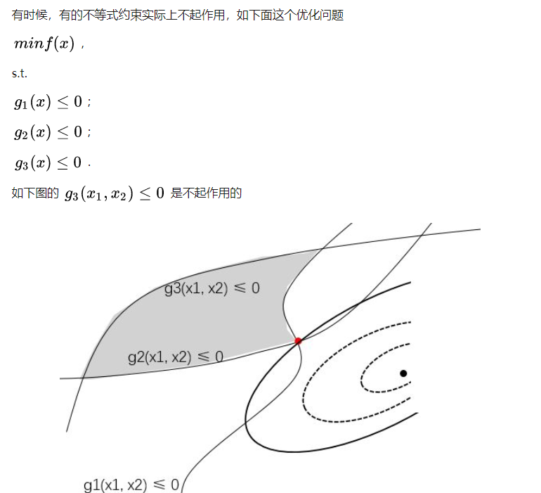
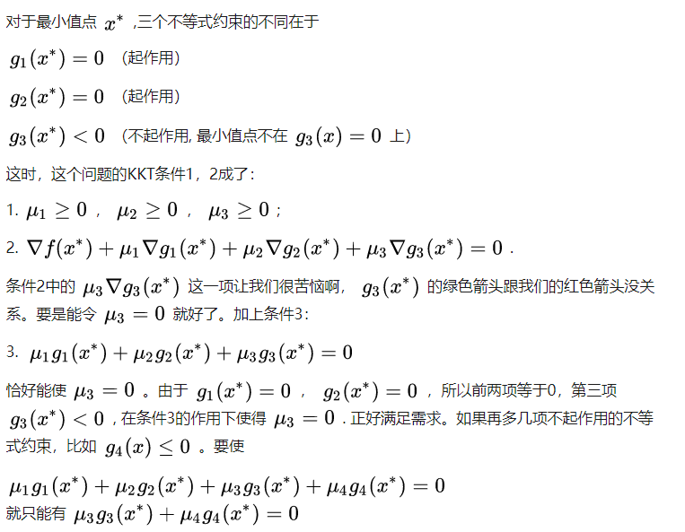
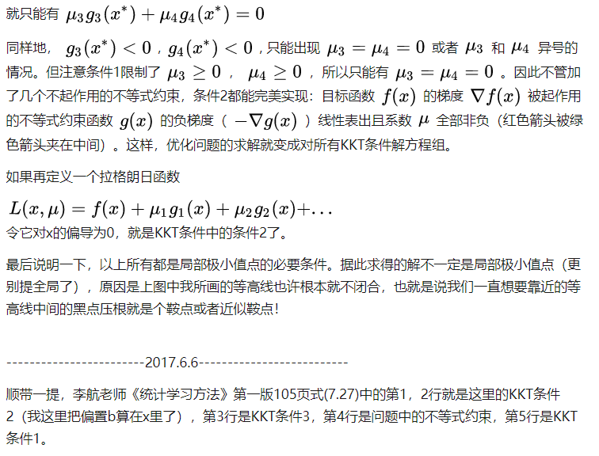

# 优化问题小结

总结一下优化问题。以下都以二维空间为例子。

## 1.无约束的优化问题。

$$minf(x)$$

其中$x=(x_1,x_2)$

​	注意我在图里画了等高线。此时 $f(x)$ 在局部极小值点 $x^*=(x_1^*,x_2^*)$ 处的梯度必然为0，比较容易理解。这个梯度为零的条件是局部极小值点的必要条件。这样，优化问题的求解变成了对该必要条件解方程组。

> mensaochun注：梯度为零只是局部极小值点的必要条件，不是充分条件，因为梯度为0的点可能是一个鞍点。
>

## 2.带等式约束的优化问题

$minf(x)$

$s.t.\ h(x)=0$

​	与无约束的问题不同。我们所要求的极小值点被限制在曲线  上，我们将 $\{x|h(x)=0\}$ 称为可行域, 解只能在这个可行域里取。如下图所示，曲线 $h(x)=0$ （黑色实曲线）经过无约束极小值点（黑点）附近。那么满足约束的极小值点应该与黑点尽可能近。我们将 $f(x)$ 的等高线不断放大，直到与曲线 $h(x)=0$相切，切点即为所求。**相切是关键，是极小值点的必要条件。**这样，优化问题的求解只需要对拉格朗日条件解方程组即可。

> mensaochun注：如果不相切，那么一定存在使$f(x)$的值更小的解$x$。

> 总结一下就是：带有等式约束的优化问题，它的最优值需要满足两个条件：1.$h(x^*)=0$；2. $\nabla f(x^*)+\lambda \nabla h(x^*)=0$，这样就可以通过构建方程组来得到最优解了。
>
> 问题：如果存在多个相切的点怎么办？

## 3.带不等式约束的优化问题

